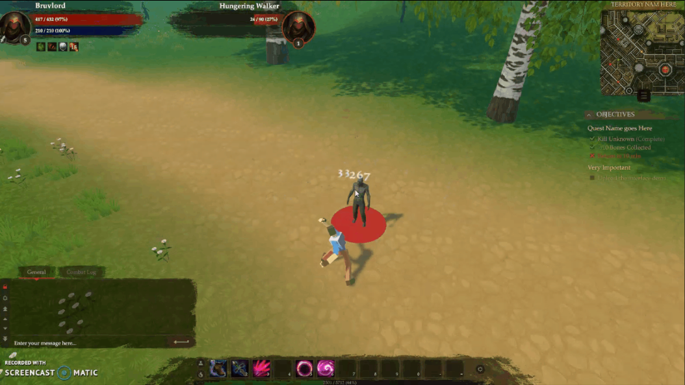
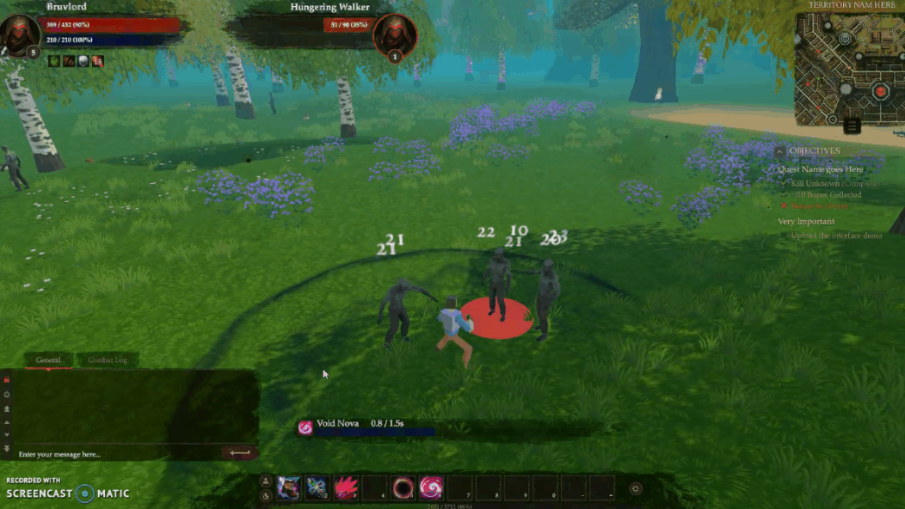
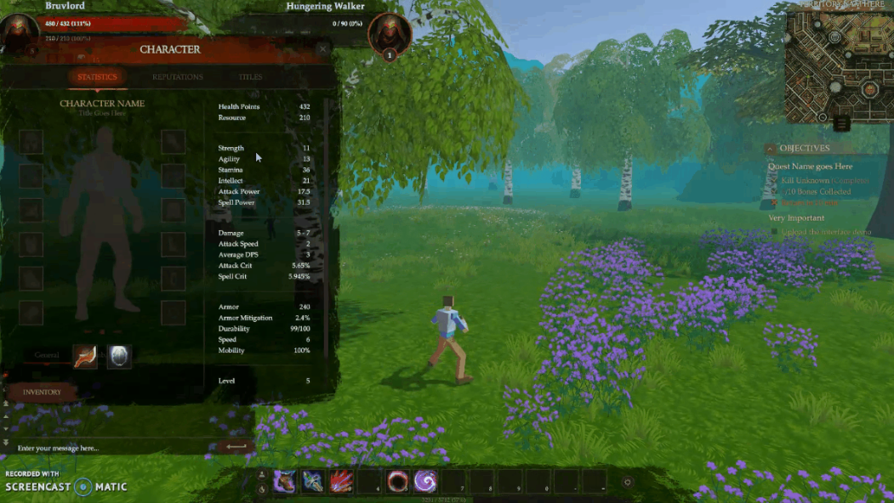
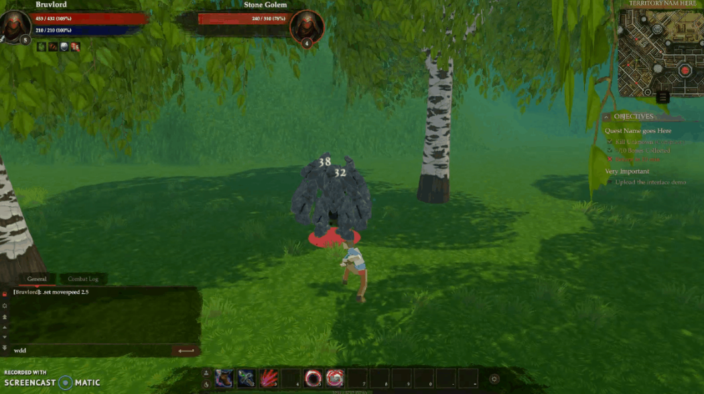

# OnslaughtGame
[WIP] Creating a 3D version of the vision I had for Onslaught when creating the 2D version in Python. This version is done in Unity with C#, with help from assets from the asset store (mostly for art/visuals/models).

Below screenshots don't showcase too much of the functionality of anything, but I'll generate gifs further along.

